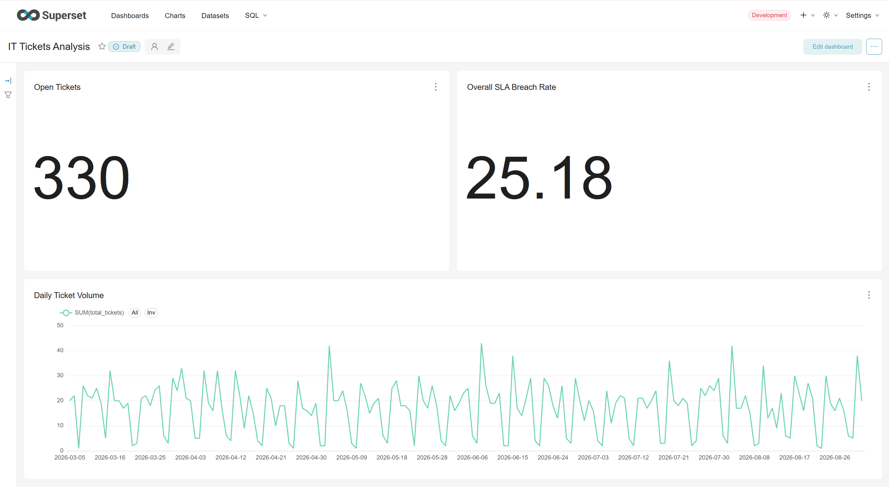
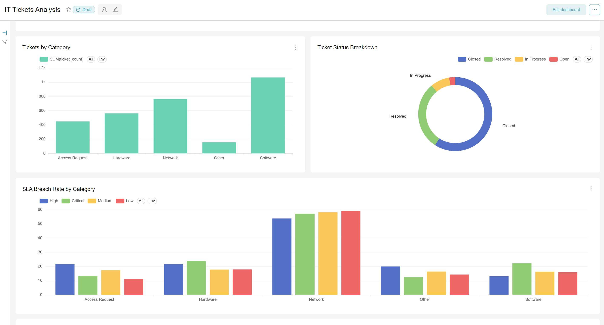
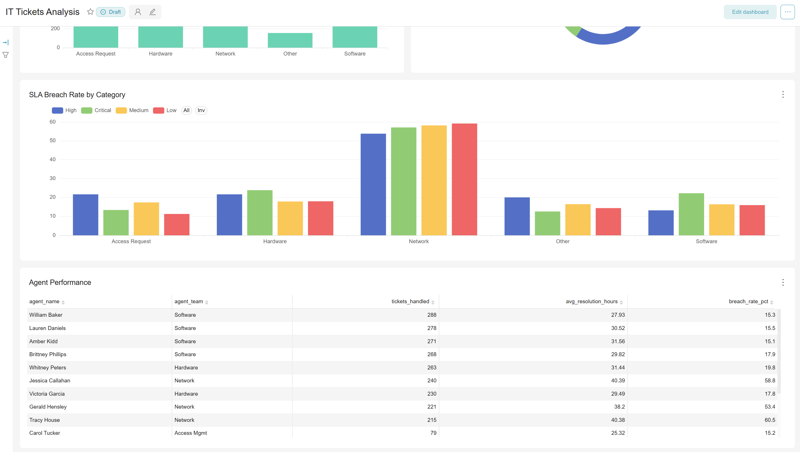

# IT Support Ticket Analytics

A self-directed data analyst project simulating an internal IT helpdesk system: database design, synthetic data generation, SQL analytical views, and a BI dashboard built in Apache Superset.

## Overview

This project models how an IT support team tracks and analyzes tickets raised by employees (broken hardware, software issues, network problems, access requests, etc.) - the kind of system real tools like Zendesk, Freshservice, or Jira Service Desk power under the hood.

## Tech Stack

- **Database:** SQLite (portable, zero-dependency; also tested against MySQL)
- **SQL Client:** DBeaver
- **BI / Visualization:** Apache Superset (self-hosted via Docker)
- **Data Generation:** Python (`faker` library)

## Data Model

| Table | Description | Rows |
|---|---|---|
| `employees` | People who raise tickets | 60 |
| `agents` | IT support staff who resolve tickets (team, shift) | 15 |
| `categories` | Ticket types (Hardware, Software, Network, Access Request, Other) | 5 |
| `sla_rules` | Target resolution time per priority level | 4 |
| `tickets` | Core fact table — every support ticket | 3,000 |

Synthetic data includes realistic patterns: higher ticket volume on Mondays and during business hours, longer resolution times for Network-category issues, ~15% SLA breach rate across the board, and a realistic mix of Open/In Progress/Resolved/Closed statuses weighted by ticket age.

## Analytical Views

Six SQL views sit on top of the raw tables to pre-aggregate metrics for the dashboard:

- **`ticket_metrics`** — enriched, one row per ticket, with resolution time and SLA breach flag calculated
- **`sla_compliance_summary`** — SLA breach rate by category and priority
- **`agent_performance`** — tickets handled and average resolution time per agent
- **`daily_ticket_volume`** — daily ticket counts by status
- **`category_breakdown`** — ticket volume and speed by category
- **`current_backlog`** — currently open/in-progress tickets and how long they've been open

## Dashboard

Built in Superset, the dashboard includes:
- Headline KPIs: total open tickets, overall SLA breach rate
- Ticket volume trend over time
- Breakdown by category and status
- SLA breach rate by category and priority
- Agent workload and performance table

## Key Findings

- **Network tickets are the clear operational bottleneck.** Agents on the Network team show SLA breach rates of 53-60% (e.g. Tracy House at 60.5%, Jessica Callahan at 58.8%), compared to just 15-18% for agents on Software and Hardware teams. This lines up with the SLA Breach Rate by Category chart, where Network is the only category breaching SLA at roughly 55-60% across every priority level, versus 10-25% elsewhere.
- **Software is the highest-volume category (~1,100 of 3,000 tickets) but also the best-managed** — its agents post the lowest breach rates in the dataset (~15%), suggesting the team is appropriately staffed relative to its load, unlike Network.
- **Overall SLA compliance sits at ~75%** (25.18% breach rate company-wide), with 330 tickets currently open or in progress — a meaningful backlog worth monitoring given roughly 1 in 4 tickets misses its target resolution time.
- Ticket status skews heavily toward Closed/Resolved (per the donut chart), with Open and In Progress making up a comparatively small live backlog, which is a healthy sign the team keeps up with volume outside of the Network bottleneck.

## Project Files

- `01_schema.sql` - database schema (MySQL version)
- `02_seed_data.sql` - synthetic ticket data (MySQL version)
- `03_views.sql` - analytical views (MySQL version)
- `03_views_sqlite.sql` - just the analytical views (SQLite version)
- `sqlite_full_setup.sql` - full schema + data + views in one script, SQLite version
- `build_sqlite.py` - Python script that generates the synthetic data and builds the SQLite database from scratch
- `it_tickets.db` - the ready-to-use SQLite database
- `screenshots/` - dashboard screenshots referenced above

## Running It Yourself

1. Load `sqlite_full_reset_clean.sql` into a SQLite database via DBeaver (or use `it_tickets.db` directly)
2. Connect Apache Superset to the database
3. Build charts on top of the 6 provided views
4. Assemble into a dashboard

## What I'd Do Next

- Add row-level access control (agents should only see their own team's tickets)
- Build a "self-service candidate" view - recurring, low-complexity tickets that could be automated or moved to a knowledge base
- Add a time-series forecast for ticket volume to inform staffing decisions
